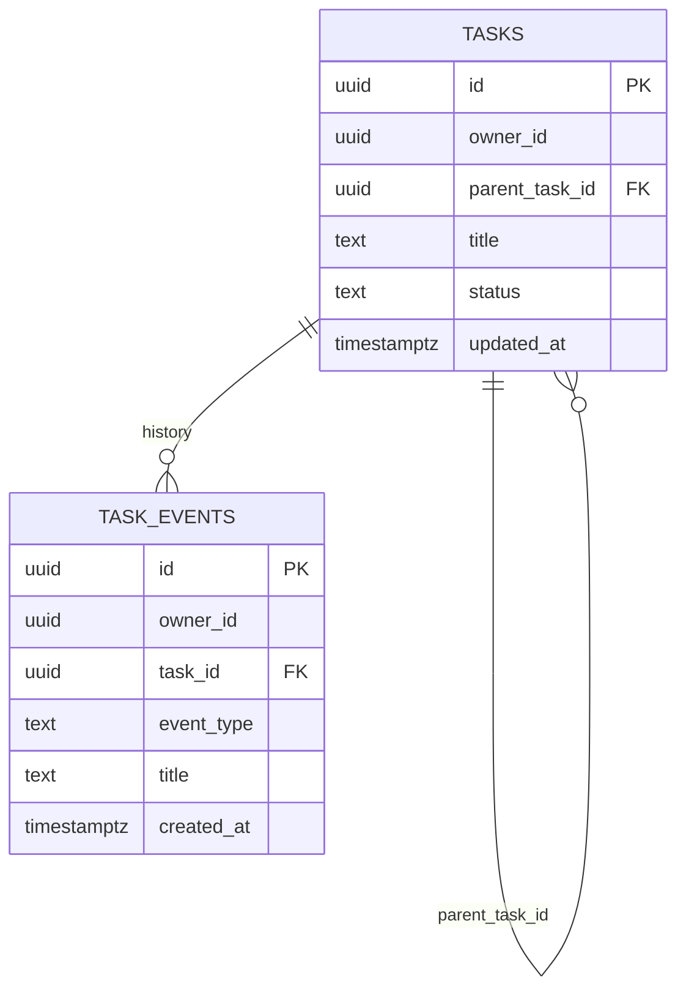

# Architecture

## Constraints

- **Multiple Apple devices/accounts.** iPhone + main laptop may be on personal iCloud account **A**,
  while the selected local backend Mac may be on another account. The backend computer cannot rely
  on account A's private iCloud sync. → sync must be **account-agnostic**.
- **Web client required**, alongside iOS + macOS → the data model and sync must be
  **client-agnostic** (not Apple-only).
- **Mandatory human confirmation** of item structure before save; confirmation must be effortless.
- **LLM/privacy:** cloud LLMs acceptable.
- **Autonomy:** auto-execute low-risk/reversible actions; approval for consequential ones.

## Key decision: a hosted sync core (not CloudKit)

Because of the web client and the two-account split, the todo data lives in a **hosted
Postgres + PowerSync** backend (deployed to Railway) rather than iCloud/CloudKit. This:

- Gives **native Swift + web SDKs** over one shared SQL data model (offline-first).
- Is **account-agnostic** — removes the cross-Apple-account bridge entirely.
- Lets the **selected local backend agent share the same database**, so "the bridge" collapses into the sync layer.

Alternative considered: Automerge (CRDT, native Swift). Choose it only if concurrent multi-device
edits of the *same* task are common; otherwise PowerSync's per-row last-write-wins is simpler.
Tracked as decision `D-sync`.

## Planes

```
            ┌──────────────────────── Account A (personal) ────────────────────────┐
            │  iOS app        macOS app                         Web app             │
 Capture &  │  (UIKit)        (AppKit)                          (React)             │
   sync     │     │  Share Sheet / Siri / Shortcuts / widget / hotkey               │
            │     └──────────────┬───────────────┬──────────────┘                  │
            └────────────────────┼───────────────┼─────────────────────────────────┘
                                 │  PowerSync (offline-first SQLite)
                          ┌──────▼───────────────▼──────┐
            Sync core     │  Postgres + PowerSync service │  (hosted on Railway)
                          └──────▲───────────────▲──────┘
            ┌────────────────────┼───────────────┼──────────── Selected backend Mac ┐
   Brain    │  local harness  ───┘   shares DB    │                                  │
            │   • enrichment (LLM, structured output, recurrence)                    │
            │   • Obsidian (Local REST API + embeddings)                             │
            │   • Gmail (extract + completion signals)                               │
            │   • web + location                                                     │
            │   • HITL via LangGraph interrupt_before                                │
            └────────────────────────────────────────────────────────────────────-─┘
```

## Item lifecycle

```
capture ──> proposed ──(human confirm)──> confirmed ──> active ──> done
                │                                          │
        agent/email/enrichment                         (agent may
         attach suggestions                         auto-complete w/ confirm)
```

Only **confirmed** items are real, visible todos. Proposals from any source (capture suggestion,
Gmail extraction, agent result, completion detection) land as `proposed` and must pass the
confirm card.

## Projects and recursive subtasks

Projects are ordinary rows in `public.tasks`, not a separate table and not just tags. A task can
point to a parent task owned by the same user, producing a recursive task tree:



The database enforces same-owner parent/child references, rejects direct self-parenting, and uses
a trigger to reject cycles. Nested markdown ingestion preserves hierarchy by creating parent rows
before child rows and setting each child's `parent_task_id`; ancestor titles remain as compatibility
tags for current tag-filter UI until dedicated project views land.

Parent/project views should roll child state and history upward: active/done/blocked counts, recent
child `task_events`, and agent progress should be visible on the parent without mutating the child's
own audit trail.

## Confirm-before-save

Every proposal renders as a **confirm card** on all clients with one-keystroke / one-swipe
accept, quick inline edit, and reject. Agent proposals carry **confidence + provenance**
(e.g. the `source_quote` from an email) so confirmation is fast and trustworthy.

## Enrichment pipeline

1. **On-device, instant** (offline, no Mini): date via chrono-node (web) / NSDataDetector (Swift);
   lightweight category guess. Gives immediate feedback on capture.
2. **Server-side, richer** (worker/local backend computer): structured LLM output (schema with project, priority, tags,
   due, recurrence, confidence, provenance); recurrence via Recognizers-Text / Duckling sidecar.

> **Implemented (M2 foundation):** `worker/` is a background enrichment service that polls Postgres
> for `proposed` rows, computes a richer suggestion (broader categories, urgency hints, full
> chrono date parsing; LLM-upgradable via `OPENAI_API_KEY`) and patches the `suggested_*` fields
> only — it never changes `status`. It currently runs as a Railway service against the shared
> Postgres; running it on the selected backend Mac against the same database is exactly the "server-side" step above. The on-device pass writes `suggestion_source='on-device'`;
> the worker upgrades it to `'server'` (or `'llm'`), and the patch syncs back to every client live.

## Agent & HITL

The selected backend computer runs a local harness adapter (Codex, Hermes, OpenClaw, or custom)
against durable approval checkpoints. Flow: agent proposes → state serialised → pushed to a confirm
card / approval queue → resume or abort on the human decision. An **autonomy policy engine**
classifies actions by risk/reversibility: low-risk auto-executes; consequential actions require
explicit approval. Item **structure is always confirmed** regardless of autonomy level.

## Integrations

- **Obsidian:** Local REST API plugin (read/search/PATCH) + embedding search for note context;
  write tasks back to daily notes in the obsidian-tasks emoji format.
- **Gmail:** OAuth2; rule-based pre-filter then LLM extraction with `source_quote` provenance;
  completion detection from replies / label changes (suggested, never auto-applied without confirm).
- **Apple Calendar:** EventKit (from the Apple-native client) for free/busy → feasibility scoring.

See `research-prior-art.md` for the specific open-source repos and patterns adopted for each.
